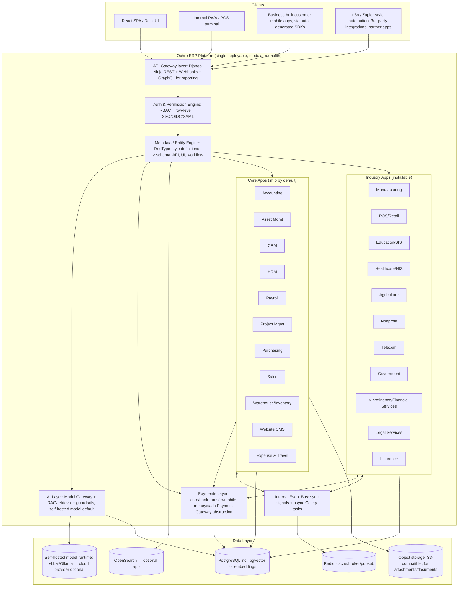

# Ochre ERP — Open-Source ERP Platform: Architecture & Design Document

*Designed to compete with Odoo, ERPNext, and Salesforce as a fully self-hosted, open-source system.*

**Decisions locked in for this design:** modular monolith architecture, Python/Django + PostgreSQL stack, pure self-hosted open-source distribution (no paid SaaS tier).

---

## 1. Executive Summary & Positioning

Odoo and ERPNext win on breadth (dozens of pre-integrated modules) and a metadata-driven development model that lets a small core team and a large community ship modules fast. Salesforce wins on CRM depth, a mature platform (Apex/Lightning) for enterprise customization, and ecosystem/marketplace gravity. Ochre ERP's wedge is: **match the module breadth of ERPNext/Odoo, keep Salesforce-grade extensibility patterns (a real platform, not just an app), and stay pure open source with no license traps** (Odoo Enterprise gates key modules behind a proprietary license; ERPNext is more permissively licensed but its cloud arm is the main sustainability engine).

| Dimension | Odoo | ERPNext (Frappe) | Salesforce | Ochre ERP (proposed) |
|---|---|---|---|---|
| License | LGPL core / proprietary Enterprise modules | GPLv3, fully open | Proprietary SaaS | Fully open source (license choice discussed in §16) |
| Architecture | Monolith, addon-based | Monolith (Frappe framework), app-based | Multi-tenant proprietary platform | Modular monolith + pluggable apps |
| Extensibility | Python addons, XML views | Python + metadata-driven DocTypes | Apex, Lightning, declarative config | Metadata-driven entity engine + Python apps |
| Self-hosting | Yes (Community free, Enterprise paid) | Yes, fully free | No | Yes, always free |
| Industry depth | Strong (many OCA modules) | Strong (Frappe ecosystem: Education, Healthcare apps exist) | CRM-centric, industry clouds cost extra | Targeted at the 11 verticals below from day one |
| Weakness we exploit | Enterprise paywall fragments the community edition | Smaller ecosystem than Odoo, Frappe framework has a learning curve | Not open source, not an ERP (no inventory/mfg/accounting core) | Must prove reliability/ops maturity against 15+ years of incumbents |

The rest of this document designs the platform to deliver on that positioning.

---

## 2. Architecture Principles

1. **Modular monolith, not microservices.** One deployable application, one team can run it, one database cluster to operate — but internally organized into strictly bounded modules with owned tables, no cross-module raw SQL joins, and all cross-module interaction through internal service interfaces or domain events. This gets Ochre ERP to feature parity fast without the operational tax microservices would impose on self-hosting users (most self-hosters do **not** want to run 15 Kubernetes services to run payroll for 40 employees).
2. **Metadata-driven core.** The single biggest reason ERPNext/Frappe can move fast with a small team is that most modules are *defined*, not hand-coded: a "DocType"-style entity definition (fields, validation, permissions, workflow states) auto-generates the database schema, REST/GraphQL API, list/detail UI, and permission checks. Ochre ERP adopts this pattern as its core innovation, described in §5.
3. **Everything is an App.** Core modules and industry modules both compile down to "Apps" — a package of entity definitions, business logic hooks, UI extensions, and migrations that installs into the running platform. Core modules are just Apps that ship by default. This is what lets industry modules (Manufacturing, POS, Education, Healthcare, Agriculture, Nonprofit, Telecom, Government) be built and maintained independently, by different teams, without forking core. The "no cross-App raw SQL, no reaching into another App's tables" rule is not just a convention — it's mechanically enforced in CI via import-linter-style contracts that fail the build if an App's code imports another App's models directly instead of going through its public service interface or the event bus, plus a migration-time check that blocks a migration from touching a table outside the App that owns it. Community-contributed Apps are additionally subject to the certification review described in §17.
4. **Multi-company and multi-currency from the start.** ERPs get retrofitted for this badly if it's an afterthought (real pain point in early Odoo/ERPNext history). Every transactional table carries `company_id` and every monetary field carries currency + exchange-rate-at-transaction-time.
5. **API-first.** Every entity defined through the metadata engine automatically gets a versioned REST endpoint. The web UI is just the first API consumer, not a special case — this is what makes the Website module, mobile apps, and third-party integration/automation tooling (n8n is a first-class citizen, §9) straightforward rather than bolted on.
6. **Boring, provable tech.** PostgreSQL, Redis, one background-job system. No premature Kafka, no premature service mesh. §18 documents exactly what gets extracted into standalone services later and under what load signal.

---

## 3. Tech Stack

| Layer | Choice | Why |
|---|---|---|
| Language/runtime | Python 3.12+ | Largest ERP-adjacent talent pool, matches ERPNext/Odoo hiring pool for community contributors, strong ecosystem for accounting/reporting/data-heavy logic |
| Web framework | Django 5.x | Batteries-included: ORM, migrations, admin, auth, i18n — all needed anyway for an ERP. Avoids reinventing session/auth/permission plumbing FastAPI would leave to us |
| Typed API layer | Django Ninja (FastAPI-style typed views, OpenAPI schema, Pydantic validation) *inside* Django, not a second framework | Gets FastAPI's DX (type hints, auto-generated OpenAPI/Swagger, async endpoints) without running two frameworks, two deployment units, and two auth stacks — see trade-off in §16 |
| Database | PostgreSQL 16+ | ACID transactions non-negotiable for accounting; native JSONB for custom fields; row-level security usable for future SaaS multi-tenancy; mature partitioning for large ledgers |
| Cache / broker | Redis | Session cache, rate limiting, Celery broker, real-time pub/sub for UI notifications |
| Background jobs | Celery + Celery Beat | Payroll runs, MRP calculations, report generation, scheduled invoicing/dunning, email/webhook delivery — all need durable async execution with retries |
| Search | PostgreSQL full-text search initially; OpenSearch as an optional pluggable app for global cross-module search at scale | Avoid a second search cluster dependency for small self-hosters; make it swappable |
| Frontend | React + TypeScript SPA, driven by the metadata engine (auto-generated forms/list/kanban/report views from entity definitions), with hand-built screens for modules that need bespoke UX (POS terminal, Gantt, financial statements) | Metadata-driven UI is what lets new modules ship without hand-building a whole CRUD screen every time; matches how Frappe's Desk UI works |
| Mobile (internal) | Progressive Web App first; native wrapper (Capacitor) for POS/field-service offline use cases | Avoids maintaining separate iOS/Android codebases pre-market-validation |
| Mobile (customer-facing) | Auto-generated typed SDKs (Swift, Kotlin, React Native/TypeScript, Flutter/Dart) from the metadata engine's OpenAPI schema, plus OAuth2+PKCE/OTP consumer auth (§10) | Lets a business build its own branded customer app without hand-rolling an API client, and keeps that client in sync as entities evolve |
| Auth | Django auth + OIDC/SAML SSO app + API keys/JWT for external integrations | Enterprises evaluating vs Salesforce expect SSO on day one |
| Reporting/BI | Built-in report builder (pivot/query builder over metadata) + optional connector app for Metabase/Superset for advanced BI | Covers 80% in-app, doesn't force us to out-build a BI tool |
| AI / ML | Pluggable Model Gateway; self-hosted open-weight models (vLLM/Ollama) by default, optional cloud LLM connectors; `pgvector` on the existing PostgreSQL for embeddings/RAG (§8) | Keeps AI features working in air-gapped deployments (§14.1) without a mandatory external dependency, and avoids standing up a separate vector database |
| Integration / Automation | n8n as the officially supported automation layer, with an auto-generated node package derived from the metadata engine's OpenAPI schema; optionally bundled as a service in the deployment stack (§9) | Gives every entity — including community-built Industry Apps — instant, always-in-sync workflow-automation support with no hand-coded connector to maintain |
| AI Tool Access (MCP) | Auto-generated MCP server exposing every entity as MCP Resources/Tools from the same OpenAPI schema; the Agentic AI layer can also act as an MCP client against external servers (§8.6) | Gives AI assistants and agents structured, RBAC-scoped access to entity data without a bespoke integration per client — the same auto-generation trick already used for the n8n package and mobile SDKs |
| Payments | Pluggable Payment Gateway abstraction; card (Stripe/Adyen/Square), bank transfer/ACH via reconciliation, mobile money (MTN MoMo, AirtelTigo Money, Vodafone Cash, M-Pesa-style) as a first-class connector class, and cash/agent-collection via Teller flows (§11) | One shared abstraction — like the AI Model Gateway and Device Bridge — so a new payment method (e.g., a mobile money provider) is written once and available to every module that accepts payments |
| Geospatial / Maps | `PostGIS` extension on the existing PostgreSQL instance; Martin tile server serving vector tiles directly from PostGIS; MapLibre GL (open-source, self-hostable) for rendering; self-hosted OpenStreetMap-derived base tiles by default, optional cloud geocoding/basemap connectors (§5) | Same "extension on the database we already run" pattern as `pgvector` for AI (§8.1) — no separate GIS server to stand up — and MapLibre/Martin avoid Google Maps/Mapbox vendor lock-in and per-load billing, keeping the air-gapped deployment (§14.1) fully functional |
| Deployment | Docker Compose (small self-host) + Helm chart (Kubernetes, larger deployments) + a `bench`-style CLI installer for one-command bare-metal install | Mirrors ERPNext's low-friction install story, which is a major adoption driver |
| CI/CD | GitHub Actions: per-app test matrix, migration-safety checks, OpenAPI schema diff checks, import-linter cross-App boundary contracts (§2), SAST/DAST and SBOM/provenance signing (§13) | Prevents one industry app's changes from silently breaking core |

---

## 4. High-Level Architecture



All Apps — core and industry — sit on the same metadata engine and talk to each other only through the internal event bus or explicit service calls, never by reaching into another App's tables directly. This is the rule that keeps the monolith from turning into a ball of mud as more industry Apps are added by more contributors, and it's enforced in CI rather than left to reviewer discipline (§2).

---

## 5. The Metadata-Driven Extensibility Framework

This is the platform's core differentiator and the reason a small team can plausibly reach Odoo/ERPNext-level breadth. Every business object (Invoice, Employee, Purchase Order, Student, Patient, Work Order...) is declared, not hand-coded, as an **Entity Definition**:

```yaml
entity: SalesInvoice
app: accounting
fields:
  - {name: customer, type: link, target: Customer, required: true}
  - {name: currency, type: link, target: Currency, default: company_currency}
  - {name: items, type: table, target: SalesInvoiceItem}
  - {name: grand_total, type: currency, computed: sum(items.amount)}
  - {name: status, type: select, options: [Draft, Submitted, Paid, Cancelled]}
permissions:
  - {role: Accountant, read: true, write: true, submit: true}
  - {role: SalesRep, read: true, write: false}
workflow:
  states: [Draft, Submitted, Paid, Cancelled]
  transitions:
    - {from: Draft, to: Submitted, action: post_to_gl}
hooks:
  before_save: [validate_customer_credit_limit]
  after_submit: [post_journal_entry, notify_customer]
```

From this single definition the engine generates: the PostgreSQL table and migration, a typed REST endpoint (`/api/v1/accounting/sales-invoice`) with OpenAPI docs, list/kanban/detail views in the SPA with correct field widgets, permission enforcement at both API and UI layers, and workflow state-machine enforcement. Developers write custom Python only for the actual business logic in hooks (`validate_customer_credit_limit`, `post_journal_entry`) — not for CRUD plumbing, serialization, or permission checks.

**Apps** are the unit of packaging: a directory of entity definitions + hook implementations + optional custom UI screens + database seed data + its own test suite. An App declares dependencies on other Apps (e.g., the Manufacturing App depends on the Warehouse and Accounting Apps). This is what lets the 11 industry modules be built, versioned, and released independently, by separate contributor teams, and lets a self-hoster install only what they need (an education nonprofit installs Core + Nonprofit + SIS, and skips Manufacturing, Telecom, Microfinance, Legal Services, and Insurance entirely).

**Bespoke UI screens are loaded, not compiled in.** Most screens never need hand-built UI at all — they're generated directly from the Entity Definition (§16 covers when this genuinely isn't enough, e.g., the POS terminal or a Gantt chart). For the Apps that do ship a custom screen, that screen is published as an independently versioned frontend bundle (JS module federation over the core SPA shell) rather than requiring a monolithic rebuild of the whole frontend for every App install or update. An Industry App can therefore ship, version, and update its bespoke UI on its own release cadence, the same way its backend entity definitions and hooks already do — the SPA shell discovers and loads installed Apps' bundles at runtime rather than at build time.

**Accessible by default.** Because the generic form/list/kanban/report views are generated from the Entity Definition rather than hand-marked-up per screen, the generator produces WCAG 2.1 AA-conformant markup once (correct semantic elements, ARIA labeling, focus management, keyboard navigation, color-contrast-safe theming) and every generated screen across every App inherits it automatically — rather than accessibility being an audit finding to fix per-module after the fact. This matters concretely for the Government citizen-services portal (§7) and Education/Healthcare portals (§10), where accessibility compliance is often a legal procurement requirement, not just good practice; hand-built screens (POS terminal, Gantt) are the exception and are held to the same WCAG bar as an explicit review checklist item before release rather than getting it for free from the generator.

**Localizable by default.** Every user-facing string the generator produces — field labels, validation messages, workflow-state names — is a translation key resolved at render time, not hard-coded text, so adding a new locale is a translation-file contribution, not a UI rewrite; this reuses Django's i18n framework (§3) rather than a bespoke system. Layout direction (LTR/RTL) is a theme-level property the generated forms/lists already respect, since they're generated from the same component library referenced in the Website theming system (§6.10), so Arabic/Hebrew-market deployments don't require hand-rebuilding every screen. Locale-aware number, date, and currency formatting follows the entity's currency/locale fields already in the data model (§12) rather than a hard-coded format string.

**Location-aware by default.** Three new field types — `geopoint` (a single coordinate), `geofence`/`polygon` (a boundary), and `route`/`line` — are declarable in an Entity Definition exactly like any other field type, backed by the `PostGIS` extension on the same PostgreSQL instance the platform already runs (§3) — the same "extension on the database we already have, not a new service to operate" pattern already established for `pgvector` and AI embeddings (§8.1). Any entity with a geo field automatically gets a fifth generated view — a **Map view** — alongside the existing form/list/kanban/report set, rendered client-side with MapLibre GL (open-source, no vendor lock-in) and served by a self-hosted Martin tile server reading vector tiles directly from PostGIS, with self-hosted OpenStreetMap-derived base tiles bundled into the offline install path (§14.4) so the air-gapped topology (§14.1) keeps working with zero external calls. Geocoding (address → coordinate) defaults to a self-hosted Nominatim instance; cloud geocoding/basemap providers (Google Maps, Mapbox, HERE) are available as an explicit opt-in connector, following the same external-provider-abstraction pattern already used for the AI Model Gateway (§8.1), Payment Gateway (§11.1), and Device Bridge (§7.2) — self-hosted by default, cloud connector opt-in, never a silent default. Geospatial queries — proximity ("agents within 5km"), containment ("is this GPS point inside this assembly's ward boundary"), and distance/route — are exposed through the same permission-scoped query layer the AI copilot's natural-language-to-safe-query translation already uses (§8.2), so "show me unpaid properties in Ward 3" is answerable the same way any other filtered query is. Field capture of a `geopoint`/`geofence` from a mobile device reuses the offline-first sync pattern already built for POS, Insurance field claims, and the customer mobile app (§7.2, §7.6, §10.6) — a collector, agent, or field officer plotting a location without connectivity queues locally and syncs on reconnect, the same as any other offline-captured record. This capability is what Government's property register and jurisdiction/ward boundaries (§7.9), Telecom's agent/dealer network and coverage-area mapping (§7.5), Microfinance's branch/agent network (§7.1), Agriculture's farm/plot boundaries (§7 table), and Insurance's catastrophe-event geographic linking (§7.6) all build on, rather than each vertical inventing its own location handling.

---

## 6. Core Module Design

Each module below is built to match or exceed the depth of the equivalent Odoo/ERPNext module, and — for CRM specifically — to cover the core of what a Salesforce Sales/Service Cloud evaluator would expect, since CRM is the module most directly competing against a non-ERP incumbent.

### 6.1 Accounting

- **General ledger & multi-book:** configurable Chart of Accounts per company, multi-currency journal entries with historical FX snapshotting, parallel books (e.g., statutory vs. management accounting) posting from the same source transaction, cost centers/dimensions/tags for cross-cutting analysis (department, region, project) without proliferating GL accounts.
- **Accounts receivable:** customer invoicing (recurring/subscription and one-off), configurable dunning/credit-control sequences, credit limit enforcement at order time (shared with Sales), payment gateway integration hooks (Stripe/PayPal/local processors), partial payments and payment plans.
- **Accounts payable:** vendor bill entry with 3-way match against PO/GRN, payment runs with batch approval, ACH/wire/cheque export file generation, early-payment discount tracking.
- **Banking:** bank feed import (OFX/CSV, Open Banking API connectors as pluggable Apps), auto-match reconciliation rules, manual reconciliation UI, multi-bank/multi-currency accounts.
- **Tax engine:** pluggable per-jurisdiction tax rules (VAT/GST/sales tax, plus other tax-rule types such as Insurance's premium tax, §7.6), tax return/report generation, e-invoicing format support (e.g., PEPPOL/UBL) as an installable App per country/region rather than baked into core.
- **Budgeting & forecasting:** budget vs. actual by account/cost center/project, budget approval workflow, rolling forecast support.
- **Consolidation:** multi-company/intercompany elimination for group reporting.
- **Financial statements:** configurable P&L, Balance Sheet, and Cash Flow templates; drill-down from any statement line to underlying journal entries; close-checklist workflow with period locking.
- **Controls:** approval thresholds on journal entries and payments, full audit trail (§12), segregation-of-duties-aware role templates.

### 6.2 Asset Management

- Asset lifecycle: acquisition (from Purchasing or manual entry), capitalization, transfers between locations/cost centers, revaluation/impairment, disposal/write-off.
- Depreciation: straight-line, declining-balance, units-of-production, and custom schedule methods; parallel tax-book vs. accounting-book depreciation.
- Maintenance: preventive maintenance schedules, work order generation, maintenance cost tracking rolled up per asset.
- Tracking: barcode/QR/RFID tag support for physical asset audits and cycle counts.
- Lease accounting: right-of-use asset and lease liability tracking (ASC 842 / IFRS 16-style) for leased equipment/property.
- Insurance & warranty tracking with expiry alerts.

### 6.3 CRM

CRM is the module most directly evaluated against Salesforce, so it's designed with the deepest capability set of any core module:

- **Lead management:** multi-source capture (web forms, email parsing, manual entry, CSV import, API), configurable lead scoring (rule-based out of the box, pluggable scoring-model hook for teams wanting ML-based scoring), assignment rules (round-robin, territory-based, workload-balanced), duplicate detection and merge tooling.
- **Accounts & contacts:** 360° account timeline (every email, call, meeting, quote, invoice, and case in one view), contact relationship mapping and org-chart-within-account, household/parent-child account hierarchies for enterprise accounts.
- **Opportunity & pipeline management:** multiple configurable pipelines per team/product line, custom stages with stage-gate exit criteria, probability-weighted and forecast-category-based forecasting (commit/best-case/pipeline, matching Salesforce's forecast model), opportunity team selling with split credit, competitor tracking per opportunity.
- **Activity & communication:** logged calls/meetings/tasks, two-way email sync (IMAP/Gmail/Outlook) with tracked opens/clicks, calendar sync (CalDAV/Google/Outlook), click-to-dial webhook hooks for telephony/CTI providers.
- **Quoting / light CPQ:** multi-line quotes with product bundles and tiered discount rules, discount-approval workflow above configurable thresholds, e-signature integration hook (DocuSign-style), one-click quote-to-Sales-Order conversion.
- **Forecasting & reporting:** rep/team/territory forecast rollups, pipeline velocity and stage-conversion analytics, win/loss reason tracking and analysis, cohort and trend reporting via the built-in report builder (§3).
- **Territory & quota management:** geographic, vertical, or account-based territory rules with automatic lead/account routing; quota planning and attainment tracking against forecasts.
- **Case / service management (light Service Cloud parity):** case queues, SLA timers with escalation rules, email-to-case and web-to-case intake, knowledge-base article linking, case-to-account/opportunity linkage for full customer context.
- **Marketing-lite:** campaign and UTM tracking on leads/opportunities, list segmentation, bulk email with unsubscribe/compliance handling; deliberately does **not** try to rebuild a full marketing-automation suite — instead exposes webhook/API connectors for Mailchimp/Klaviyo/HubSpot-style tools.
- **Automation:** workflow and approval-process builder, assignment/escalation rules, scheduled follow-up reminders, and custom server-script hooks on any CRM entity (validate, before-save, after-save) — the CRM-module analogue of Salesforce Flow/Process Builder, built on the same metadata hook system used platform-wide (§5).
- **Mobile & offline:** PWA-based mobile CRM for field/outside sales reps with offline activity logging and sync-on-reconnect.
- **Permissions:** territory- and team-based row-level visibility, private/public/team sharing rules, field-level security per role (e.g., hide margin/cost fields from junior reps).

### 6.4 HRM

- Employee lifecycle: structured onboarding/offboarding checklists, document management with expiry alerts (contracts, certifications, visas), org chart with reporting-line visualization.
- Leave: configurable leave types and accrual rules, multi-level approval chains, team leave calendar.
- **Attendance capture:** every clock-in/out is its own Attendance entity (employee, timestamp, method, geo-location if applicable) rather than a pre-aggregated daily total, so exceptions — missed punch, early leave, late arrival — can be flagged and corrected before a payroll run rather than after. Capture methods: manual entry, geo-fenced check-in/out from the employee self-service app, QR/kiosk punch stations, and badge/RFID or biometric time-clock hardware — the last of these reuses the same core Device Bridge abstraction already built for POS (§7.2) rather than a separate hardware-integration stack, just with a badge-reader/biometric device class alongside POS's scanners and terminals, including the same offline-queue-and-replay behavior for a till or clock that temporarily loses connectivity.
- **Shift scheduling & overtime rules:** configurable shift patterns and rest-day rules, with jurisdiction-aware overtime and shift-differential calculation (daily/weekly thresholds, night-shift premiums) computed directly from captured Attendance entities rather than a manually re-keyed timesheet — feeding straight into Payroll's hour-based components (§6.5).
- **Third-party attendance integration:** because Attendance is a regular entity on the metadata engine (§5), any third-party time-clock or workforce-management platform — a dedicated biometric-device vendor's cloud service, or a scheduling tool like Deputy or When I Work — can both push clock-in/out events in and pull them back out through the same n8n integration layer used platform-wide (§9.1): an inbound webhook creates/updates an Attendance record with the idempotency-key protection already described in §9.1 so a retried punch webhook never creates a duplicate clock event, and an outbound Attendance-created/updated trigger keeps an external payroll bureau, workforce-analytics tool, or compliance system in sync without a bespoke point-to-point integration.
- Recruitment: job requisition and approval, candidate pipeline (kanban), interview scheduling and scorecards, offer-letter generation feeding into onboarding.
- Performance: goal/OKR tracking, configurable review cycles (self, manager, peer/360), competency frameworks, calibration views for HR/leadership.
- Employee self-service portal: payslip access, leave requests, document uploads, directory search.
- Case tracking for disciplinary/grievance processes with confidentiality-aware permissions.
- People analytics: headcount, turnover/attrition, span-of-control, and representation dashboards.

### 6.5 Payroll

- Configurable salary structures and components (earnings, deductions, benefits) per employee grade/contract type.
- **Hour-based pay from Attendance:** regular, overtime, and shift-differential components are computed automatically from HRM's Attendance entities and shift/overtime rules (§6.4) at payroll-run time rather than re-entered manually, with an exception queue that blocks a payroll run from finalizing until every employee's unresolved attendance gaps (missed punch, unapproved absence) are cleared or explicitly overridden by an approver.
- Statutory compliance packs: pluggable per-country tax tables, social security, and pension rules — installed as Apps so new country support doesn't require touching core.
- Multi-country payroll run support for organizations with employees in more than one jurisdiction.
- Off-cycle runs: bonus, commission, and correction runs separate from the regular cycle.
- Loans/advances with automatic deduction scheduling against future payslips.
- Payslip generation with employee self-service access (via the HRM portal).
- Statutory filing report generation and year-end tax form generation (jurisdiction-dependent, delivered via country packs).
- Automatic GL posting to Accounting with configurable account mapping per component.

### 6.6 Project Management

- Multiple views: Gantt (with dependencies and critical-path highlighting), kanban, list, and calendar.
- Resource allocation and capacity planning across concurrent projects.
- Timesheets with billable/non-billable flagging, approval workflow, and direct flow-through to Sales/Accounting invoices.
- Budget vs. actual cost tracking per project/phase/task, including labor cost from timesheets and material cost from Warehouse consumption.
- Milestone-based and retainer-based billing models, multi-currency for international client work.
- Project templates for repeatable engagement types.
- Risk/issue log and a client-facing portal for external visibility without exposing internal system access.

### 6.7 Purchasing & Supply Chain

- Requisition-to-PO workflow with configurable multi-level approval matrices by amount/category.
- RFQ and vendor comparison (side-by-side quote comparison before award).
- Vendor scorecarding: on-time delivery, quality/rejection rate, price competitiveness tracked over time.
- Blanket and contract purchase orders for recurring procurement against a pre-negotiated agreement.
- Three-way match automation (PO vs. GRN vs. vendor invoice) with configurable tolerance thresholds.
- Vendor self-service portal for PO acknowledgment and invoice submission, reducing manual data entry.
- Landed cost allocation (freight, duty, insurance) across received inventory.
- Drop-ship support and purchase return/debit-note handling.
- **Strategic sourcing (RFx):** RFI (Request for Information) and RFP (Request for Proposal) workflows alongside RFQ, with weighted scoring criteria (price, quality, delivery, sustainability) rather than price-only comparison; an optional e-auction/reverse-auction mode for competitive bidding on defined-spec categories, running on the same workflow/approval engine as everything else on the platform (§5) rather than a bolted-on module. This is also what the Government App's tendering workflow (§7) extends, rather than building its own bidding mechanism from scratch.
- **Supplier onboarding & qualification:** a structured pre-engagement workflow — compliance document collection (insurance certificates, tax registration, certifications), qualification questionnaires (including ESG/sustainability), and approval gating before a supplier can receive a PO. This is distinct from vendor scorecarding, which measures performance *after* onboarding, not before.
- **Spend analytics:** category-level spend visibility (a "spend cube" by category, supplier, business unit, and time period), spend-under-management tracking, and maverick-spend (off-contract purchasing) detection, built on the same report builder used platform-wide (§3) rather than a separate BI tool.

**Further extensions (noted, not yet fully specified):**

- **Contract lifecycle management (CLM):** a supplier-contract repository with renewal alerts and obligation tracking — a natural reuse of Legal Services' document assembly and e-signature integration (§7.3) once that App exists, rather than a duplicate capability built into Purchasing.
- **Supply chain risk monitoring:** single-source-dependency flagging, supplier financial-health signals, and geographic/geopolitical risk tracking — a natural extension of the AI layer's existing vendor-risk flagging (§8.3) once there's enough real supplier data to model against.
- **Logistics/transportation management:** inbound freight and carrier-rate-shopping, multi-leg logistics planning, and import/export customs documentation — would follow the same external-connector pattern as the Payment Gateway (§11) and Device Bridge (§7.2): a pluggable Carrier/Logistics Gateway rather than a bespoke TMS built from scratch. See §18 for when this gets prioritized.

### 6.8 Sales Management

- Order management with partial fulfillment, backorder handling, and delivery scheduling tied to Warehouse.
- Price lists with tiered, customer-specific, and volume-based pricing; promotion/discount rule engine.
- Commission calculation engine configurable by rep, team, product line, or deal size.
- Contract and recurring/subscription billing support for service and SaaS-style revenue lines.
- Credit-limit checks at order time (shared logic with Accounting AR).
- Territory and quota alignment shared with the CRM module rather than duplicated.
- Return Merchandise Authorization (RMA) workflow tied back to Warehouse and Accounting credit notes.

### 6.9 Warehouse / Inventory

- Multi-warehouse, multi-bin/location structure with configurable putaway and picking strategies (FIFO/FEFO/LIFO).
- Barcode and RFID scanning support for receiving, picking, and cycle counts.
- Serial and batch/lot tracking with expiry-date management (critical for the Healthcare and Agriculture industry Apps).
- Cycle counting and full physical inventory workflows with variance reporting.
- Inter-warehouse stock transfers and in-transit tracking.
- Reorder-point/safety-stock automation with auto-generated purchase requisitions.
- Valuation methods: FIFO, moving average, or standard cost, selectable per item category.
- Pick-pack-ship workflow with shipping-carrier label-generation webhook integration.
- Dropship and consignment stock support.

### 6.10 Website / CMS

- Drag-and-drop page builder using the same component library as the core SPA, so branding stays consistent without a separate design system.
- E-commerce storefront: cart, checkout, and multiple payment-gateway integration hooks, with real-time stock availability read from Warehouse.
- SEO tooling: meta tag management, sitemap generation, structured data (schema.org) for product/article pages.
- Blog/news engine and multilingual content support.
- Web forms that feed directly into CRM as Leads, with UTM/campaign tracking preserved end to end.
- Customer self-service portal: order status, invoice/statement download, support-case submission — reusing Sales, Accounting, and CRM data rather than duplicating it.
- Theming system for partners/implementers to brand deployments, plus a headless/API mode for teams that want to build a fully custom frontend against the same generated APIs (§5).

### 6.11 Expense & Travel Management

A module Odoo and ERPNext both ship as standard and that was previously missing here — expense claims and corporate travel are a distinct workflow from Accounts Payable (§6.1), not just a vendor bill with a different label.

- **Expense claims:** mobile receipt capture with AI-assisted OCR line-item extraction (reuses document intelligence, §8.2) feeding a structured expense report, configurable expense-category and per-diem policies, and policy-violation flagging (over-limit, missing receipt, duplicate submission) before approval rather than after reimbursement.
- **Approval & reimbursement:** multi-level approval chains shared with the HRM approval framework (§6.4), reimbursement via payroll off-cycle run (§6.5) or a direct AP payment run (§6.1), and GL posting with cost-center/project allocation (shared with Project Management timesheets, §6.6).
- **Corporate card reconciliation:** bank-feed-style statement import and auto-match against submitted expense claims (reuses the Banking auto-match engine, §6.1), with unmatched-charge exception queues.
- **Travel booking & policy:** optional booking-tool integration hooks (flight/hotel), pre-trip approval, and travel-policy enforcement (fare class, hotel rate caps) at booking time rather than only at expense-claim time.
- **Mileage tracking:** configurable per-distance reimbursement rates with GPS-assisted or manual trip logging.
- **Analytics:** spend-by-category, spend-by-employee, and policy-compliance dashboards via the built-in report builder (§3) — the same "spend cube" pattern already used for Purchasing spend analytics (§6.7).

---

## 7. Industry Modules (as Apps)

| Industry App | Core purpose | Built on top of |
|---|---|---|
| **Manufacturing** | Bill of Materials, Routing/Work Centers, Work Orders, MRP (material requirements planning), Shop Floor reporting | Warehouse (material issue/receipt), Purchasing (subcontracting, raw material buy), Accounting (WIP/COGS costing) |
| **POS (Retail)** | Offline-first terminal UI, till/session management, barcode scanning, receipt printing, promotions/discounts, physical device integration | Sales (order creation), Warehouse (real-time stock deduction), Accounting (daily cash reconciliation posting) — see §7.2 for hardware/device integration |
| **Student Information System (Education)** | Admissions, Conflict-free Course/Class/Room Scheduling, Enrollment, Attendance, Standards-based & Traditional Grading, Special Education (IEP/504) Case Management, State/Provincial Compliance Reporting, Fee Schedule, Parent/Student Portal | HRM (staff/faculty as Employees), Accounting (fee invoicing and receivables), CRM (admissions pipeline reuse) — flagged for FERPA/IDEA-aligned field-level access control and audit logging, see §13; see §7.7 for the platform capabilities this App requires beyond simple extension |
| **Hospital Information System (Healthcare)** | Patient records (lightweight EHR), Clinical order management (CPOE) with decision support, Bed/ward (ADT) management, Appointment scheduling, Encounter/nursing documentation, Pharmacy & eMAR, Lab/Radiology order-result integration, Revenue cycle management, Patient portal | Warehouse (pharmacy/supplies stock), Accounting (patient billing/insurance claims), HRM (clinical staff) — flagged for HIPAA/GDPR-aligned field-level encryption and audit logging, see §13; submits insurance claims from the provider side, see the Insurance App's payer-side boundary note, §7.6; see §7.8 for the platform capabilities this App requires beyond simple extension |
| **Agriculture Management** | Farm/Plot registry with `geofence` plot boundaries (§5), Crop cycle planning, Input application (seed/fertilizer) tracking, Yield/harvest tracking, Livestock registry | Warehouse (input/output stock), Purchasing (input procurement), Accounting (cost-per-plot reporting) |
| **Nonprofit** | Donor Management & Moves Management (extends CRM's Lead/Contact model), Grant & Fund Accounting (restricted/unrestricted fund tracking extension to Accounting), Grantseeker Lifecycle Management, Beneficiary Case Management & Outcomes Measurement, Volunteer Management (extends HRM), Multi-Channel Fundraising Campaigns | CRM, Accounting, HRM directly extended, not duplicated — see §7.10 for the platform capabilities this App requires beyond simple extension |
| **Telecommunications** | Subscriber/Service registry, Usage-based rating & billing, Recurring/prepaid billing, CPQ for service bundles | Sales (contracts/CPQ), Accounting (recurring revenue recognition), CRM (subscriber support cases) |
| **Government** | Tendering/e-procurement workflow with Open Contracting Data Standard (OCDS) publication (extends Purchasing with public-tender rules and vendor eligibility), Permitting, Licensing & Code Enforcement, GASB-compliant Fund Accounting with Encumbrance/Budgetary Control, Grants Management (grantor & grantee), 311/Citizen Case Management, Public Records (FOIA) Request Management, Citizen services portal (extends Website), mandatory audit-trail and records-retention policies | Purchasing, Accounting, Website extended; stricter permission/audit requirements applied platform-wide when this App is installed — see §7.9 for the platform capabilities this App requires beyond simple extension |
| **Microfinance / Financial Services** | Loan Products, Loan Origination & Application workflow, Loan Accounts & Repayment Schedules, Savings Accounts (individual & group), Group/Center Lending (solidarity groups, village banking), Guarantor & Collateral Management, Credit Scoring, KYC/AML Checks, Teller/Cash Management, Mobile Money & Agent Banking integration | Accounting (loan/savings GL posting, AR), CRM (borrower/member accounts, group hierarchies), AI Layer (credit scoring, KYC document verification), HRM (loan officer assignment) — see §7.1 for the platform capabilities this App requires beyond simple extension |
| **Legal Services** | Matter Management, Client Intake & Conflict-of-Interest Checking, Trust Accounting (IOLTA/client-funds ledger), Time & Billing (hourly/flat-fee/contingency, LEDES e-billing), Court Deadline & Statute-of-Limitations Calendaring, Document Assembly & Management, Client Portal | Project Management (matters as projects), CRM (client/contact and adverse-party records), Accounting (trust sub-ledger, billing), AI Layer (conflict-check fuzzy matching, document review assistance) — see §7.3 for the platform capabilities this App requires beyond simple extension |
| **Insurance** | Policy Administration (quote/bind/endorse/renew), Rating & Underwriting, Claims Management (FNOL, adjudication, SIU fraud flagging), Claims Reserve Ledger (incl. IBNR), Reinsurance (ceded treaty/facultative), Agent/Broker & Commission Management, Statutory/Solvency Reporting | Accounting (premium AR, reserve ledger), CRM (policyholder/agent accounts), Sales (commission engine reuse), AI Layer (underwriting risk scoring, claims fraud detection), Payments Layer (premium billing/collection) — see §7.6 for the platform capabilities this App requires beyond simple extension |

Note the repeated pattern: every industry App **extends** a core App's entities (via the metadata engine's inheritance/extension mechanism) rather than duplicating Customer, Invoice, or Employee concepts. This is what avoids the "13 different definitions of a Contact" problem that fragments a lot of ERP ecosystems as they grow. Manufacturing, Telecom, Microfinance, Legal Services, Insurance, Education, Healthcare, Government, and Nonprofit are the nine verticals that need real new platform capability beyond simple extension, each discussed in its own subsection below.

### 7.1 Microfinance / Financial Services — capabilities beyond simple extension

Most industry Apps in the table above are "free" in the sense that they only extend existing core entities — Nonprofit's fund accounting is still Accounting's ledger, just with restricted/unrestricted fund tags. Microfinance is different: loan and savings math doesn't reduce to Accounting's existing GL/depreciation logic, so this App needs a few genuinely new shared capabilities, in the same way Payroll needed pluggable per-country statutory packs (§6.5) rather than just extending an existing entity:

- **Loan amortization/interest engine:** flat-rate, declining-balance, and reducing-balance repayment-schedule generation, shipped as a shared calculation library the Microfinance App depends on — conceptually parallel to Asset Management's depreciation-schedule engine (§6.2), but for interest-bearing liabilities rather than depreciating assets.
- **Savings interest engine:** configurable compounding (daily/monthly/quarterly), tiered rate structures, and minimum-balance rules.
- **Group lending structures:** extends CRM's account hierarchy (§6.3) with joint-liability groups, group meeting/attendance tracking, and per-member vs. per-group repayment allocation.
- **Credit scoring:** a scoring-model hook into the AI layer's Model Gateway (§8.1) — starts as a rule-based scorecard (repayment history, group standing, collateral coverage) with an optional ML-model upgrade path.
- **KYC/AML workflow:** identity-document capture and verification using AI document intelligence (§8.2), sanctions/watchlist screening hooks, and suspicious-activity case management, with every check logged to the universal audit trail (§12) — required for regulatory compliance in essentially every microfinance jurisdiction.
- **Prudential/regulatory reporting:** portfolio-at-risk (PAR 30/90), loan-loss provisioning, and capital-adequacy-style reports delivered as pluggable per-country/regulator report packs, following the same "compliance packs are Apps, not core" pattern already used for Accounting's tax rules (§6.1) and Payroll's statutory rules (§6.5).
- **Teller & cash management:** branch-level cash-in/cash-out, till reconciliation, and end-of-day cash-position reporting — architecturally similar to POS's till/session model (see the POS row above) but for loan disbursement/collection rather than retail sales.
- **Mobile money & agent banking:** webhook/API connectors for mobile-money providers (M-Pesa-style) and agent-banking networks, following the same integration-hook pattern already used for payment gateways in Accounting (§6.1). Branch and agent locations are plotted using the geospatial capability (§5), giving loan officers a Map view of branch/agent coverage and a "nearest agent to this borrower" query for group-lending field visits and cash-in/cash-out routing.

This makes Microfinance a good example of the platform's general extensibility limit: the metadata engine (§5) and App system make *most* new verticals close to free, but a vertical with genuinely novel calculation/compliance logic still needs real engineering investment — just scoped to a self-contained App rather than a core rewrite.

### 7.2 POS — Device & Hardware Integration

Retail POS is only as good as its hardware integration; the module needs to reliably drive real store hardware, not just render an on-screen till.

- **Device abstraction layer:** a driver-plugin interface (the same pattern as the AI layer's Model Gateway, §8.1) that decouples POS transaction logic from device specifics. Supported device classes: barcode scanners, receipt/thermal printers, cash drawers, card/payment terminals, barcode label printers, customer-facing displays, and weighing scales. New device drivers plug in without touching POS business logic.
- **Connectivity paths:**
  - **Browser-native (WebHID/WebUSB/WebSerial):** on Chromium-based browsers/kiosks, the PWA talks directly to USB/HID/serial devices with no extra software — covers most USB barcode scanners (HID keyboard-emulation mode works everywhere with zero integration), USB/serial receipt printers, and USB scales.
  - **Native wrapper (Capacitor, §3 Mobile row):** for devices needing deeper OS-level access (Bluetooth card readers, some proprietary payment terminals) or browsers without WebHID/WebUSB support, the same POS UI runs inside the Capacitor native shell with native device plugins.
  - **Local hardware bridge (optional):** for network-attached (IP) receipt printers, older serial equipment, or multiple tills sharing one printer, a small local bridge service (on the till PC or a local print server) receives print/drawer-kick jobs over the LAN, so device I/O keeps working even if the till's browser session restarts.
- **Receipt/thermal printers:** ESC/POS command-set support (the de facto standard across thermal-printer vendors) over USB, network (raw IP socket), or Bluetooth, with a receipt template engine (logo, line items, tax breakdown, QR code for e-receipts) shared with the label-printing use case.
- **Cash drawers:** driven via the standard RJ11/RJ12 "kick" cable from a compatible receipt printer (industry-standard, no separate driver needed) or a directly USB-connected drawer controller.
- **Card/payment terminals:** integration hooks for card-present payment processors (Stripe Terminal, Square Terminal, Adyen, and region-specific processors), supporting EMV chip and NFC/contactless tap-to-pay. The ERP itself never touches raw card data — the terminal/processor SDK handles PCI-scoped card data end-to-end and returns only a tokenized payment confirmation to Sales/Accounting (§6.1, §6.8), keeping Ochre out of PCI-DSS scope.
- **Barcode scanners:** USB-HID keyboard-emulation scanners work with zero configuration; Bluetooth scanners pair via OS-level Bluetooth or WebHID; a camera-based fallback (phone/tablet camera with in-browser barcode decoding) covers low-cost setups with no dedicated scanner hardware.
- **Weighing scales:** serial/USB integration for fresh-produce and bulk-item pricing, including variable-weight embedded barcodes (price/weight encoded directly in the barcode), common in grocery retail.
- **Customer-facing display:** optional second-screen output showing running total, item list, and active promotions during checkout.
- **Offline resilience:** consistent with POS's offline-first design (table above), print/drawer-kick/display commands are queued locally and replayed once a device reconnects, so a temporarily disconnected printer or dropped Bluetooth connection never blocks a sale.
- **Device management:** an admin screen registers which devices are attached to which till/terminal, configures printer templates, and tests each device per store location — not something hand-edited in config files.

This approach modernizes past the legacy OPOS/JavaPOS driver standards still common in enterprise retail hardware for the browser-native path, while remaining compatible with existing OPOS-certified equipment via the native-wrapper/local-bridge paths for stores with hardware already deployed.

### 7.3 Legal Services — capabilities beyond simple extension

Like Microfinance (§7.1), Legal Services needs a few genuinely new platform capabilities rather than being a pure extension of existing core entities — the compliance and calculation logic here doesn't reduce to what Accounting or Project Management already provide.

- **Trust accounting (IOLTA/client-funds ledger):** legal trust accounting is one of the most heavily regulated areas of practice management — client funds must be held in a trust account entirely segregated from firm operating funds, with a per-client trust ledger, and reconciled three ways (trust bank balance, sum of client ledger balances, and the trust account's own journal) rather than the two-way bank reconciliation Accounting normally does (§6.1). Modeled as a dedicated ledger type alongside — never merged into — the general ledger, with hard guardrails blocking any transaction that would commingle trust and operating funds or overdraw an individual client's trust balance, even when the pooled trust account itself has sufficient funds. Retainer deposits and trust top-ups flow through the same Payment Gateway as any other payment (§11), but post to the trust ledger, never AR.
- **Conflict-of-interest checking:** before a new matter or client can be opened, the system searches every party — client, opposing party, related party, witness — ever associated with any matter in the firm's history for a match, using the same AI-assisted fuzzy-matching approach already built for KYC/AML checks in Microfinance (§7.1, §8.2), rather than the simple duplicate-contact detection in CRM (§6.3), since a conflict check has to catch near-matches (name variants, related entities) that duplicate detection isn't designed to. A conflict hit blocks matter creation pending a documented waiver or ethical-wall decision, logged to the audit trail (§12).
- **Matter management:** extends Project Management (§6.6) with matter-specific fields — matter type, responsible/originating attorney, related matters, adverse parties, statute-of-limitations date — rather than duplicating the project entity.
- **Court deadline and statute-of-limitations calendaring:** jurisdiction-specific deadline-calculation rules (e.g., "X days from service of process," court-specific filing windows) delivered as pluggable per-jurisdiction rule packs, following the same "compliance packs are Apps, not core" pattern already used for Accounting's tax rules and Payroll's statutory rules (§6.1, §6.5). Missed deadlines are a leading cause of legal malpractice claims, so these ship with mandatory reminder escalation rather than a plain calendar entry.
- **Time & billing:** billable/non-billable time capture reuses Project Management's timesheet entity (§6.6), extended with fee arrangements (hourly, flat-fee, contingency, capped/blended rates) and LEDES e-billing export — a standardized electronic-invoice format many corporate clients require, conceptually parallel to the PEPPOL e-invoicing format already supported in Accounting (§6.1).
- **Document assembly & management:** template-driven document generation built on the metadata engine (§5), with version control and e-signature integration reusing the e-signature hook already defined for CRM quoting (§6.3).
- **Client portal:** secure document sharing and matter-status visibility, reusing the Customer permission scope and customer-facing API already built for other verticals (§10) rather than a bespoke portal.

---

## 8. AI Capabilities

AI is designed as a cross-cutting platform layer — not a single bolted-on chatbot module — so it competes directly with Salesforce Einstein/Agentforce and goes further than Odoo's and ERPNext's more limited AI add-ons, while staying consistent with the self-hosting and no-phone-home principle (§14.3): AI runs on infrastructure the operator controls by default, with external providers strictly opt-in.

### 8.1 Architecture: an AI layer, not a bolted-on chatbot

- **Model gateway:** a pluggable abstraction over model providers. Self-hosted open-weight models (Llama/Mistral/Qwen-class, served via vLLM or Ollama) are the default, air-gap-compatible option; optional connectors to cloud LLM APIs are available for operators who want frontier-model quality and accept the external dependency. The same abstraction covers embeddings.
- **Metadata-driven, like everything else:** an entity declares which fields/actions are AI-eligible directly in its Entity Definition (§5) — the platform handles model calls, context assembly, permission scoping, and guardrails centrally, so individual Apps don't hand-roll their own AI integration.
- **Retrieval layer:** entities are automatically indexed into a vector store (using the `pgvector` extension on the same PostgreSQL instance — no extra infrastructure dependency) for retrieval-augmented generation (RAG) over the operator's own data: contracts, support cases, knowledge-base articles, historical transactions.
- **Guardrails:** every AI action is scoped by the same RBAC/row-level permissions as a human user (§13) — an AI agent can never read or act on data the calling user couldn't; every AI-initiated write flows through the same audit trail as a human-initiated one (§12), tagged as AI-originated.
- **Human-in-the-loop by default:** any AI action that would post a financial entry, send an external communication, or change a workflow state requires explicit human approval unless an operator deliberately configures autonomous mode for a specific, lower-risk action.

### 8.2 Platform-wide AI features

- **Natural-language copilot:** a chat-style assistant embedded in the UI that answers questions ("show me overdue invoices over $10k from Q2," "which vendors missed SLA this month") by translating natural language into a safe, permission-scoped query against the metadata engine — never arbitrary SQL execution.
- **Document intelligence:** OCR plus structured-field extraction for vendor invoices, receipts, ID documents, and contracts, feeding directly into Purchasing/Accounting/HRM entities instead of manual data entry.
- **Anomaly & fraud detection:** flags duplicate invoices, unusual GL entries, expense-policy violations, and irregular approval patterns for review.
- **Drafting assistance:** AI-drafted email replies, dunning letters, job descriptions, and report narratives — always an editable draft, never auto-sent without approval.

### 8.3 Module-specific AI

| Module / App | AI capability |
|---|---|
| CRM (§6.3) | Lead scoring, next-best-action suggestions, call/meeting summarization, win/loss reason extraction from notes |
| Accounting (§6.1) | Bank-transaction auto-categorization, cash-flow forecasting, anomaly detection on journal entries |
| HRM (§6.4) | Resume-screening assistance (human-reviewed, bias-audited), attrition-risk flagging, review-narrative drafting |
| Purchasing & Supply Chain (§6.7) | Invoice/PO OCR extraction, vendor-risk flagging from scorecard trends, RFx proposal scoring assistance, maverick-spend/spend-anomaly detection |
| Warehouse (§6.9) | Demand forecasting and reorder-point suggestions from historical stock movement |
| Manufacturing | Predictive-maintenance flags from work-order history, MRP exception explanation |
| Healthcare / HIS | Clinical note summarization (opt-in, on-prem model required by default given PHI sensitivity) |
| Education / SIS | Grading assistance and at-risk-student flagging from attendance/grade trends |
| Agriculture | Yield prediction from historical harvest, weather, and input-application data |
| Government | Citizen-inquiry chatbot grounded in RAG over published policy documents, with mandatory human review before any binding response |
| Microfinance (§7.1) | Rule-based/ML credit scoring, KYC document verification (ID OCR + face match hook), suspicious-activity (AML) pattern flagging, loan-default risk prediction |
| Legal Services (§7.3) | Conflict-of-interest fuzzy-name matching across matter history, contract clause extraction/review assistance, document summarization, matter-outcome risk flagging |

### 8.4 Trust, governance, and data privacy

- **Opt-in by default for anything leaving the instance:** self-hosted open-weight models work fully in the air-gapped topology (§14.1) with zero external calls; connecting a cloud model provider is an explicit per-operator configuration choice, never a silent default.
- **Field-level exclusion:** any field can be flagged in its Entity Definition as excluded from AI context (e.g., salary, national ID, PHI), so sensitive data is never sent to a model — local or cloud — unless explicitly permitted.
- **Explainability & audit:** every AI-assisted action logs which model, which retrieved context, and which human approved it, satisfying the same audit requirements already imposed on the Government and Healthcare Apps (§12, §13).
- **Bias review for high-stakes use cases:** recruitment screening and performance-review assistance ship with documented limitations and require a human decision-maker; the platform never auto-rejects a candidate or auto-finalizes a review score.

---

## 9. Integration & Automation Layer (n8n)

The internal event bus and hook system (§2, §5) handle in-process business logic — validations, GL postings, notifications. For orchestrating *across* systems, and for human-in-the-loop or third-party integration workflows that shouldn't be hard-coded into an App, Ochre treats [n8n](https://n8n.io) as a first-class, officially supported integration layer rather than an afterthought API consumers happen to use — a natural fit given n8n is itself open-source and self-hostable, consistent with §14's self-hosting philosophy.

### 9.1 First-class n8n support

- **Auto-generated node package:** because every entity's REST endpoint and OpenAPI schema is generated by the metadata engine (§5), an official `n8n-nodes-ochre` package is generated directly from that schema rather than hand-coded. Every entity — core or industry, including community-built Apps — automatically gets full Create/Read/Update/List/Delete "Resource" and "Operation" support in n8n the moment it's installed, with zero manual node-authoring per entity. Most third-party ERP integrations for n8n are hand-maintained and lag the product; here the node package can't drift out of date, because it's derived from the same schema the UI and API are derived from.
- **Webhook triggers:** any entity's lifecycle events (create, update, submit, workflow-state transition) can be subscribed to as an n8n Trigger node, backed by the same internal event bus already used for in-process hooks (§4) — exposed externally as outbound webhooks rather than requiring n8n to poll.
- **Scoped credentials:** n8n connects using an API key or OAuth2 client tied to a service-account role, enforced through the same RBAC/row-level permission system as any human user (§13) — a workflow can never read or write more than the service account it's configured with allows.
- **Audit trail parity:** every write performed via the n8n/API integration is logged to the universal audit trail (§12), tagged as automation-originated — the same pattern already used for AI-originated actions (§8.1).

### 9.2 Deployment

- **Optional bundled service:** the Docker Compose bundle and Helm chart (§14.1, §14.4) include an optional `n8n` service alongside the app/worker/Postgres/Redis stack, so self-hosters get integration automation without depending on n8n's cloud offering or standing up separate infrastructure — consistent with the no-phone-home principle (§14.3).
- **External n8n also supported:** operators already running n8n (self-hosted or n8n Cloud) simply install the node package and connect — bundling is a convenience, not a requirement.

### 9.3 Example use cases

- **Inbound (payments):** a Stripe/PayPal payment webhook → n8n → creates a paid Sales Invoice (§6.1) in Ochre.
- **Inbound (lead capture):** a web form submission, landing-page builder, or ad-platform webhook (e.g., Facebook/Google Lead Ads) → n8n → creates a CRM Lead (§6.3) directly in Ochre, using the auto-generated Lead resource's Create operation (§9.1) with n8n handling field mapping and duplicate-checking before the record lands, rather than a bespoke web-to-lead integration per source.
- **Inbound (scheduling sync):** an external booking tool (e.g., a Calendly-style scheduling page or a patient-facing booking widget) → n8n → creates or updates an Appointment (Healthcare, §7) or a CRM Activity (§6.3) when a customer books, reschedules, or cancels, using the same Update/Create operations so the externally-facing calendar and Ochre never drift out of sync.
- **Outbound:** a new CRM Lead (§6.3) → n8n → posted to Slack and added to a mailing list.
- **Cross-vertical:** a Microfinance loan disbursement (§7.1) → n8n → triggers a mobile-money payout API call and logs the confirmation back onto the Loan Account.
- **Ops:** a failed background job or low-stock Warehouse alert (§6.9) → n8n → pages the on-call channel, complementing the platform's own observability (§14.5).

---

## 10. Customer-Facing Mobile App API

The Mobile row in §3 and the offline-first design in §7.2 cover *internal* mobile use — staff, POS, field service. This section covers the other half: the API layer is designed so a business running Ochre can build and publish its **own branded mobile app for its customers** — shoppers, patients, students, loan/savings members, subscribers, citizens — the same way the Website module already supports a headless mode for custom frontends (§6.10). This is treated as a first-class deliverable of the platform, not something left to third-party integrators to reverse-engineer.

### 10.1 Auto-generated mobile SDKs

Following the same principle as the n8n node package (§9.1): since every entity's REST endpoint and OpenAPI schema is generated by the metadata engine (§5), typed client SDKs — Swift for iOS, Kotlin for Android, TypeScript for React Native, and Dart for Flutter — are generated from that same schema rather than hand-written, and stay in sync automatically as entities and fields evolve. A business's mobile team starts building against a fully typed client library from day one instead of hand-rolling HTTP calls and manually keeping request/response models up to date.

### 10.2 Consumer-appropriate authentication

- **OAuth2 Authorization Code + PKCE** for native mobile clients — the standard pattern for public/native apps with no embedded client secret — distinct from the internal API-key/service-account pattern used for n8n and other server-to-server integrations (§9.1).
- **Passwordless options:** email/SMS one-time-passcode and magic-link login, in addition to standard credentials — customer apps (retail shoppers, patients, citizens) shouldn't be forced into the same login model as staff.
- **Short-lived access tokens with refresh-token rotation**, plus a device/session management screen so a customer can view and revoke active app sessions from their account.
- **Social login connectors** (Google/Apple/Facebook) as optional pluggable auth providers, using the same OIDC pattern already used for staff SSO (§13).

### 10.3 A distinct Customer permission scope

- The RBAC/row-level engine (§13) already restricts records by role; a dedicated **Customer** role class is scoped so an authenticated customer can only ever see their own Sales Orders, Invoices, Support Cases, Loan/Savings Accounts, Appointments, and so on — never another customer's records, and never internal-only fields (cost, margin, internal notes) even on their own records.
- Field-level allow-lists per entity (extending the field-level-security pattern already used for CRM, §6.3, and Security, §13) mean a new custom field added for internal use is never accidentally exposed through the customer-facing API without being explicitly whitelisted — safer default than "expose everything and remember to hide the sensitive parts."

### 10.4 Mobile-appropriate API design

- **Sparse fieldsets and cursor-based pagination** (`?fields=...`) keep payloads small on mobile networks — genuinely important given the low-connectivity contexts already discussed for Agriculture, Microfinance, and Nonprofit field use (§7.1).
- **Optional GraphQL surface** (already used for reporting, §3) extends to customer-app queries, letting a mobile screen fetch exactly the fields it needs in a single round trip instead of chaining multiple REST calls.
- **CDN-friendly media delivery** with on-the-fly image resizing, rather than serving full-resolution files from the app server — relevant to product catalogs (Website/e-commerce, §6.10) and document uploads (KYC, §7.1).

### 10.5 Push notifications

The internal event bus (§4) gains a push-notification dispatch path (APNs for iOS, FCM for Android) alongside its existing webhook/n8n path (§9) — an order-status change, a loan repayment due date, an appointment reminder, or a support-case reply can trigger a push notification the same way it can trigger a webhook, using the same entity-event subscription model rather than a separate notification system. Device push tokens are stored per customer/device and follow the same consent and audit requirements as any other customer data (§12).

### 10.6 Offline resilience

The offline-first sync pattern built for POS (§7.2) — local queueing, conflict resolution, replay-on-reconnect — is exposed as a reusable client-side pattern for customer apps operating in low-connectivity conditions, relevant again to the Agriculture, Microfinance (agent-collected repayments), and Nonprofit field-program use cases already in scope.

### 10.7 API versioning and stability guarantees

Unlike the internal SPA, which upgrades in lockstep with the platform, a business's published mobile app is an independently released artifact sitting in app-store review queues it doesn't fully control. Versioned endpoints (`/api/v1/...`, §5) therefore carry a documented deprecation policy — minimum notice before a breaking change, and a parallel-run window for old and new versions — so an Ochre upgrade an operator applies never silently breaks an app already in customers' hands.

### 10.8 Representative customer apps this API fronts

Retail storefront and order tracking (Sales, Warehouse, Website — §6.8, §6.9, §6.10); Microfinance customer app for loan/savings balance, repayment, and statements (§7.1); Telecom subscriber self-service for usage, billing, and top-up (§7); Education parent/student portal for grades, attendance, and fees (§7); Healthcare patient app for appointments, records access, and billing (§7); Government citizen-services app (§7); Nonprofit donor/beneficiary app (§7).

---

## 11. Payments Layer

Payment reception is currently described piecemeal across Accounting (§6.1), POS (§7.2), Website checkout (§6.10), and Microfinance (§7.1) — each independently referencing "payment gateway integration hooks." This section formalizes it as a shared core capability, following the same pattern already used for AI (Model Gateway, §8.1), hardware (Device Bridge, §7.2), and client generation (SDK Generator, §9.1/§10.1): one abstraction every payment-touching module plugs into, rather than each hand-rolling its own processor integration.

### 11.1 Payment Gateway abstraction

- A pluggable driver interface, architecturally identical to the Device Bridge (§7.2) and Model Gateway (§8.1) pattern, that decouples "record a payment against an Invoice, Loan Account, or Sales Order" business logic from the specifics of how the money actually moved.
- Every module that needs to receive a payment — Accounting AR (§6.1), POS (§7.2), Website checkout (§6.10), Microfinance repayment (§7.1), Telecom billing (§7), and the customer mobile app (§10) — calls the same internal Payment Gateway API rather than integrating a processor SDK directly. Adding a new payment method once (a new mobile money provider, say) makes it available to every module automatically, instead of requiring four separate integrations.
- Consistent with the card-terminal design in §7.2, the platform never touches raw card data or mobile money PINs/OTPs directly. Card drivers tokenize through the processor's SDK; mobile money drivers redirect or push a payment request to the provider's own authorization flow (USSD prompt or provider app). Ochre only ever receives a confirmation or webhook, keeping it out of PCI/payment-license scope for the underlying money movement.

### 11.2 Supported connector classes

- **Card processors:** Stripe, Adyen, Square — card-present via the POS terminal SDK (§7.2), and card-not-present for Website checkout, invoice payment links, and in-app payment.
- **Bank transfer / ACH / wire:** not gateway-mediated in real time — reconciled via bank feed import and auto-match rules (§6.1) for payments that arrive without an API-level confirmation.
- **Mobile money:** a first-class connector class, not an afterthought — MTN Mobile Money, AirtelTigo Money, and Vodafone Cash for Ghana, and equivalent providers (M-Pesa-style) elsewhere, via each provider's collections/payment-request API. This is the connector class explicitly missing from the platform today, and the one that should ship first for any deployment where mobile money is the dominant payment rail.
- **Cash:** recorded directly through the POS till (§7.2) or Microfinance Teller & Cash Management (§7.1) flows rather than routed through a gateway, with the same end-of-day reconciliation either way.
- **Agent banking / branch collection:** for Microfinance specifically (§7.1), payments collected by a field agent or at a branch are recorded through the same Teller flow and reconciled the same way as cash.

### 11.3 In-app payment collection

The customer mobile app (§10) gets a "Pay" action wired to the same Payment Gateway — pay an invoice, make a loan repayment, top up a prepaid balance, or check out a cart — using the same driver set as every other channel. A payment method added once works in the app without separate mobile-specific integration work. For mobile money specifically, the app triggers a payment request to the customer's own registered mobile money number and waits for the provider's webhook confirmation, rather than collecting mobile money credentials in-app.

### 11.4 Recording and reconciliation

- Every successful payment, regardless of connector, creates a Payment entity linked to its source document (Sales Invoice, Loan Account, Sales Order) and posts to Accounting (§6.1) through the same GL-posting hooks used elsewhere in the platform — there is no separate "payments ledger" disconnected from the core GL.
- Failed, pending, and reversed payments are modeled as explicit states rather than a simple success/failure flag — common with mobile money, where a customer can abandon a payment prompt — so Accounting and Microfinance repayment logic can distinguish "payment initiated" from "payment confirmed."
- Every payment event, successful or not, is logged to the universal audit trail (§12).

---

## 12. Data Model Highlights

- **Multi-company:** every transactional entity carries `company_id`; users are granted roles per company; consolidated reporting rolls up across companies with intercompany elimination rules in Accounting.
- **Multi-currency:** every monetary field is `(amount, currency)`; exchange rates are timestamped and snapshotted onto the transaction at posting time so historical reports never reprice.
- **Custom fields everywhere:** the metadata engine supports admin-added custom fields on any entity (backed by a JSONB column with optional promotion to a real typed column at scale) — this is a frequently-cited reason customers stay on Salesforce/Odoo rather than migrate, so it has to exist from day one, not as a v2 feature.
- **Universal audit trail:** every entity write is versioned (who, when, before/after diff) via a shared `AuditLog` mechanism at the ORM layer, not opt-in per module — required for the Government and Healthcare Apps' compliance needs and useful everywhere else.
- **Soft-delete + document numbering:** financial documents are never hard-deleted (cancel/reverse instead), with configurable numbering series per company/branch.

---

## 13. Security, Permissions & Compliance

- **RBAC + row-level rules:** roles (Accountant, Sales Rep, HR Manager, etc.) grant entity-level permissions (read/write/submit/cancel); row-level rules restrict *which* records (e.g., a Sales Rep only sees their own Opportunities) — both enforced identically at the API layer and the UI layer because both read the same metadata permission definitions.
- **SSO:** OIDC and SAML apps ship in core so enterprise self-hosters can integrate Okta/Azure AD/Google Workspace without a paid tier, directly countering a common objection to leaving Salesforce.
- **Field-level encryption:** available per-field in the metadata definition (used by Healthcare for PHI, Nonprofit for donor PII, HRM for salary/national-ID fields).
- **Audit & retention:** the universal audit trail (§12) plus configurable data-retention policies satisfy the Government and Healthcare Apps' regulatory requirements without a bespoke compliance module.
- **Secrets & deployment hardening:** environment-based secrets, no default admin credentials shipped, mandatory HTTPS in the reference deployment configs, dependency and container image scanning in CI.

---

## 14. Deployment & Operations — Self-Hosting Is the Product, Not an Afterthought

Every architectural choice in this document (modular monolith over microservices, Postgres/Redis over a sprawling service mesh, no mandatory external SaaS dependency anywhere in the request path) is in service of one goal: a business can run Ochre entirely on its own infrastructure — on-prem servers, a private cloud VPC, or even fully air-gapped — with no ongoing dependency on Ochre's maintainers, no license-key server to phone home to, and no feature gated behind a hosted-only tier. This is the explicit differentiator against Salesforce (no self-host option exists at all) and against Odoo (Enterprise features require a paid subscription and periodic license validation).

### 14.1 Deployment topologies

| Topology | Who it's for | What it looks like |
|---|---|---|
| **Single-server** | Small business, first-time evaluators, <100 users | One VM/bare-metal box running the Docker Compose bundle (app + worker + Postgres + Redis + reverse proxy). Lowest ops burden, single point of failure accepted as a trade-off. |
| **Multi-server / HA** | Mid-market, production-critical deployments | App and worker tiers on 2+ nodes behind a load balancer; Postgres as a primary + standby (streaming replication) or managed via an operator; Redis with Sentinel. Deployed via the Helm chart on Kubernetes, or via Ansible playbooks for teams not running K8s. |
| **Air-gapped / offline** | Government, defense, healthcare, or any environment with no internet egress | All container images, Python/JS dependencies, and OS packages are mirrored into an offline bundle (`ochre-offline-bundle-<version>.tar`) that installs with zero external network calls. License validation, update checks, and telemetry are never in the code path at all (see §14.3), so nothing breaks in an air-gapped environment — this is a deliberate design constraint, not just a supported mode. |
| **Existing K8s/PaaS platform** | Organizations standardizing on their own platform team's tooling | Published Helm chart with documented values for ingress, storage class, and secrets-manager integration (Vault, Sealed Secrets, or plain K8s Secrets), so platform teams can fold Ochre into their existing GitOps pipeline (ArgoCD/Flux) rather than adopting a bespoke deploy process. |

### 14.2 System requirements (guideline, tune per company size)

| Scale | App/API tier | Worker tier | PostgreSQL | Redis |
|---|---|---|---|---|
| Small (≤50 users, Core Apps only) | 2 vCPU / 4 GB RAM | Shared with app tier | 2 vCPU / 4 GB RAM, 50 GB disk | 512 MB |
| Mid-market (≤500 users, Core + a few Industry Apps) | 4–8 vCPU / 8–16 GB RAM, 2 replicas | 2–4 vCPU / 4 GB RAM dedicated | 4–8 vCPU / 16 GB RAM, SSD, streaming replica | 1–2 GB, HA pair |
| Large (500+ users, Manufacturing/POS/multi-company) | Horizontally scaled, autoscaled | Horizontally scaled, queue-split | Dedicated managed instance or operator-run cluster with read replicas | Redis Sentinel/Cluster |

### 14.3 No phone-home, no forced connectivity

Unlike license-key-gated commercial products, nothing in Ochre's request path calls out to an external service to function — no license server, no mandatory update-check ping, no analytics beacon enabled by default. Any optional telemetry (e.g., anonymous version-adoption stats to help the project prioritize work) is **opt-in, disabled by default, and documented in one file** so an operator can audit exactly what, if anything, ever leaves their network. This is what makes the air-gapped topology in §14.1 possible at all, and it's a direct, explicit contrast with SaaS-only Salesforce and license-gated Odoo Enterprise.

### 14.4 Installation paths

- **One-command installer:** `ochre install` — a CLI (mirroring ERPNext's `bench` tool, which is a proven low-friction adoption driver) that provisions the Docker Compose stack, generates secrets, runs initial migrations, and creates the first admin/company on a fresh server with minimal prompts.
- **Docker Compose bundle:** for teams that want to read and modify the compose file directly rather than go through the installer.
- **Helm chart:** for Kubernetes-based production and HA deployments (§14.1).
- **Bare-metal / systemd option:** a documented non-Docker install path (Python venv + systemd units + native Postgres) for operators whose policy disallows containers entirely — a real requirement in some government and regulated-industry environments.
- **Reverse proxy & TLS:** ships with a reference Caddy config (automatic Let's Encrypt TLS) plus documented nginx/Traefik alternatives for operators integrating into an existing edge setup.

### 14.5 Backups, updates, and data ownership

- **Backups:** scheduled `pg_dump`/WAL-archiving configuration and a one-command restore path are documented as a first-class feature, not an afterthought — ERP data loss is catastrophic for a business, and undocumented backup/restore is one of the most common self-hosting failure modes.
- **Updates:** downloadable, versioned release bundles (not a forced auto-update) so an air-gapped or change-controlled environment can pull an update on its own schedule; a guarded migration runner checks for destructive schema operations before applying them, and an App version-compatibility matrix blocks installing an Industry App against an incompatible core version.
- **Data portability:** full database export (schema + data) and per-entity CSV/JSON export are standard features, not a paid add-on — an operator's data is never harder to get out than it was to put in, which is the practical test of "no lock-in."
- **Observability:** structured logging plus OpenTelemetry traces/metrics exported to whatever the operator already runs (Prometheus/Grafana, Datadog, etc.); health-check endpoints for the app and worker tiers so standard infra monitoring (and any existing on-call tooling) works without a bespoke integration.

---

## 15. Non-Functional Targets & Scale Path

| Concern | v1 target | Scale path when exceeded |
|---|---|---|
| Concurrent users per instance | ~500–1,000 active users on a modest single-node deployment (4–8 vCPU app tier + managed Postgres) | Horizontally scale the stateless web/API tier; move Postgres to a larger instance / read replicas for reporting queries |
| Transaction volume | Tens of thousands of ledger entries/day comfortably on a single Postgres primary | Table partitioning on high-volume ledgers (Stock Ledger, GL Entry) by date/company; read replicas for BI |
| Background job throughput | Single Celery worker pool handles payroll/MRP/report generation for mid-market volumes | Scale worker pool horizontally; split queues by priority (interactive webhooks vs. heavy batch jobs like MRP runs) |
| Multi-tenant SaaS | Out of scope for v1 by decision (§ deployment model) | If revisited: schema-per-company or Postgres Row-Level Security policies are already compatible with the `company_id`-everywhere data model, so this is additive, not a rearchitecture |

---

## 16. Trade-off Analysis

- **Modular monolith vs. microservices:** chosen the monolith because self-hosting operational simplicity is a *feature* for this audience — SMBs and mid-market IT teams evaluating this against Odoo/ERPNext are not going to run a service mesh. The cost is that a bug in one App's background job can, in the worst case, affect the whole process; mitigated by Celery worker isolation per queue and by strict module-boundary rules enforced in CI (no cross-App direct DB access).
- **Django + Django Ninja vs. Django + a separate FastAPI service:** a single framework avoids duplicating auth, permissions, and DB connection handling across two runtimes, at the cost of Django Ninja being a less mature ecosystem than either Django REST Framework or standalone FastAPI. Revisit if a specific workload (e.g., very high-throughput public webhook ingestion) genuinely needs a separately scalable async service.
- **Metadata-driven engine vs. hand-coded modules per App:** the metadata engine is more upfront investment (§5 has to exist and be solid before *any* module ships) but is the only realistic way a small core team reaches ERPNext/Odoo's module breadth; the risk is the engine becoming a bottleneck/leaky abstraction for modules with genuinely unusual UX (POS terminal, Gantt charts, financial statement layouts) — those are explicitly allowed to ship hand-built UI on top of the generated API rather than fighting the generic UI generator.
- **License choice (AGPLv3 vs. Apache-2.0/MIT):** since the distribution decision is pure self-hosted with no paid SaaS tier, the "AGPL closes the SaaS loophole" argument (why Odoo/Mongo-style projects pick AGPL) doesn't apply the same way here. Apache-2.0 maximizes enterprise adoption (many enterprise legal teams are wary of AGPL) and community contribution ease. Recommendation: **Apache-2.0** for the core platform, revisit only if a future business model change (e.g., an official hosted offering) makes AGPL's copyleft protection valuable again.
- **Single shared Postgres schema vs. schema-per-company:** shared schema with `company_id` filtering is simpler to operate and migrate; schema-per-company gives stronger isolation but multiplies migration/ops complexity. Chosen: shared schema for v1, with the data model already shaped so schema-per-tenant is an additive change later, not a rewrite.
- **Self-hosted-by-default AI vs. cloud-API-first AI (§8):** defaulting to self-hosted open-weight models keeps every AI feature working in air-gapped deployments and avoids a silent external dependency, at the cost of generally weaker model quality than the latest frontier cloud models and the operational burden of running a GPU-capable model runtime for operators who enable it. Mitigated by making cloud providers a one-line config change for operators who prioritize capability over air-gap purity, and by keeping AI features additive (the platform is fully usable with AI disabled entirely).
- **Committing to a public, externally-consumed mobile API surface (§10):** unlike the internal SPA's API usage, a customer-facing mobile API is consumed by artifacts (app-store apps) the platform team doesn't control the release cadence of, which imposes a real versioning/deprecation discipline cost (§10.7) that a purely internal API wouldn't need. Accepted because it's a genuine differentiator versus Odoo/ERPNext (neither auto-generates mobile SDKs) and versus Salesforce (mobile access is available but not as a from-your-own-data-model generated client) — mitigated by generating the SDKs from the same schema that already has to stay stable for the n8n integration (§9), so the discipline is shared cost, not duplicated cost.
- **A shared Payment Gateway abstraction vs. per-module processor integration (§11):** building one core abstraction before any payment feature ships is more upfront work than letting Accounting, POS, Website, and Microfinance each integrate a processor independently — the same kind of early-investment trade-off as the metadata engine itself (§5 has to exist before any module ships). Chosen because payment methods (especially mobile money providers) proliferate per-market, and a shared driver interface means each new connector is written once instead of four times; it also keeps the PCI/payment-scope reasoning (raw card and mobile-money credentials never touch Ochre) consistent and auditable in one place rather than re-derived per module.

---

## 17. What Gets Revisited As It Grows

- **Payroll compliance engine per country** is the most likely first extraction into a standalone service — tax/statutory rule sets change independently of core release cycles and benefit from independent versioning/deployment once more than a handful of countries are supported.
- **Reporting/BI** may be extracted once report query load starts contending with transactional workload on the primary Postgres — introduce a dedicated read-replica-backed reporting service at that point rather than before.
- **POS offline sync** may need a dedicated lightweight sync service once retail deployments scale to hundreds of terminals with unreliable connectivity — the offline-first design in §7 anticipates this without committing to it in v1.
- **Long-running business processes** (multi-step procurement approvals, MRP runs, manufacturing routing) currently modeled as Celery task chains; if approval/workflow complexity grows significantly (many industry Apps each with their own multi-step workflows), evaluate migrating to a durable workflow engine (e.g., Temporal) rather than hand-rolling state machines per App.
- **Event bus:** the internal in-process event bus (§4) is deliberately *not* Kafka/NATS in v1. Introduce an external event bus only when a real integration-fan-out need appears (e.g., many external systems need to react to the same domain events in near-real-time) — premature infrastructure here would tax every self-hoster for a scale problem most won't have.
- **Carrier/Logistics Gateway** (§6.7): logistics/transportation management is deliberately left unbuilt in v1 rather than half-built — freight/carrier-rate-shopping and customs documentation are only worth a dedicated connector abstraction (mirroring the Payment Gateway, §11) once enough deployments have real cross-border or multi-carrier shipping volume to justify it; until then, the existing shipping-label webhook hooks in Warehouse (§6.9) cover basic outbound fulfillment.
- **Contract lifecycle management** (§6.7): rather than building a standalone CLM capability, this is expected to fall out naturally once the Legal Services App's document assembly and e-signature integration (§7.3) exist — Purchasing would then extend that same capability for supplier contracts instead of duplicating it.

---

## 18. Suggested Repository Structure

```
ochre/
├── core/
│   ├── metadata_engine/        # entity definition parser, schema/API/UI generator
│   ├── auth/                   # RBAC, SSO (OIDC/SAML), API keys
│   ├── audit/                  # universal audit trail
│   ├── platform_api/           # gateway, webhooks, GraphQL reporting layer
│   ├── ai_gateway/              # Model Gateway, RAG/retrieval, AI guardrails (§8)
│   ├── device_bridge/           # pluggable hardware driver interface: scanners, printers, terminals, scales (§7.2)
│   ├── sdk_generator/           # generates n8n node package (§9) and mobile SDKs (§10) from the OpenAPI schema
│   └── payments_gateway/        # pluggable payment driver interface: card, bank transfer, mobile money, cash (§11)
├── apps/
│   ├── accounting/
│   ├── asset_management/
│   ├── crm/
│   ├── hrm/
│   ├── payroll/
│   ├── project_management/
│   ├── purchasing/
│   ├── sales/
│   ├── warehouse/
│   ├── website/
│   ├── manufacturing/
│   ├── pos/
│   ├── education_sis/
│   ├── healthcare_his/
│   ├── agriculture/
│   ├── nonprofit/
│   ├── telecom/
│   ├── government/
│   ├── microfinance/
│   └── legal_services/
├── frontend/                   # React/TS SPA, metadata-driven view renderer
├── deploy/
│   ├── docker-compose/
│   └── helm/
└── docs/
```

Each App directory is independently testable and installable, enforcing the "core Apps are just Apps that ship by default" principle from §2.

---

## 19. Phased Roadmap

1. **Phase 0 — Platform foundation:** metadata engine, auth/RBAC/SSO, API gateway, SPA shell with generic view rendering, deployment tooling. Nothing is sellable yet, but every later phase depends on this being solid.
2. **Phase 1 — Core MVP:** Accounting, CRM, Sales, Purchasing, Warehouse, HRM — enough for a services or trading business to run entirely on Ochre.
3. **Phase 2 — Round out core:** Payroll, Project Management, Asset Management, Website — closes the gap with a full ERPNext/Odoo Community feature set.
4. **Phase 3 — Highest-pull verticals:** Manufacturing and POS/Retail, mirroring where Odoo and ERPNext themselves saw their first strong vertical traction.
5. **Phase 4 — Remaining industry Apps:** Education, Healthcare, Agriculture, Nonprofit, Telecom, Government, Microfinance/Financial Services, and Legal Services — sequence by community/contributor demand and partner interest rather than a fixed order, since each is a substantial standalone effort. Microfinance and Legal Services in particular should be scheduled after the AI layer (Phase 0/§8), Accounting's tax-engine pattern, and the Payments Layer (§11) are proven, since both reuse the AI Model Gateway (credit scoring/KYC for Microfinance, conflict-checking for Legal), the "compliance packs as Apps" pattern (§7.1, §7.3), and — for Legal's trust accounting — a dedicated ledger type that needs to be built and audited carefully before it can be trusted with client funds.

---

## Assumptions Made

- "Pure self-hosted open source only" means no official hosted SaaS product is in scope for this design, though the data model does not preclude one being added later.
- Target customer profile is SMB-to-mid-market businesses and organizations (including nonprofits and government bodies) capable of self-hosting or working with an implementation partner, matching the ERPNext/Odoo Community adoption pattern rather than Salesforce's enterprise-direct model.
- "Compete with Salesforce" is scoped to the CRM/Sales module and platform extensibility story, not to Salesforce's broader Marketing Cloud/Service Cloud ecosystem, which is out of scope for an ERP system.
